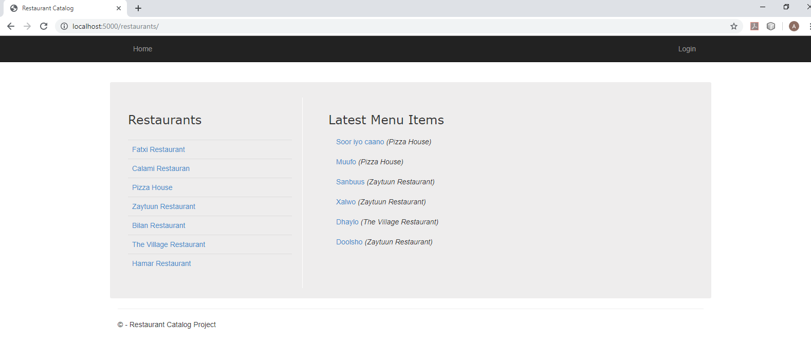
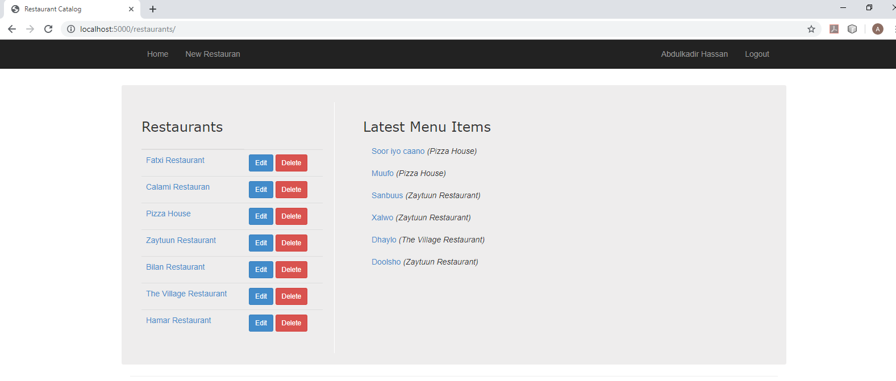
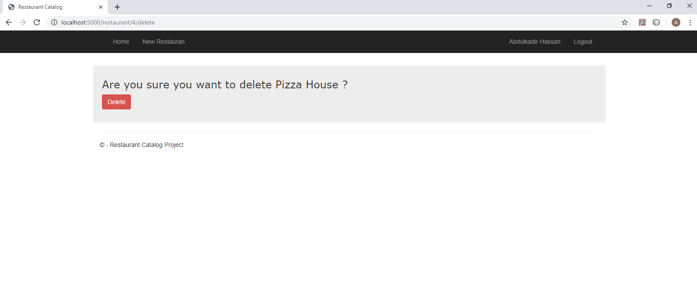
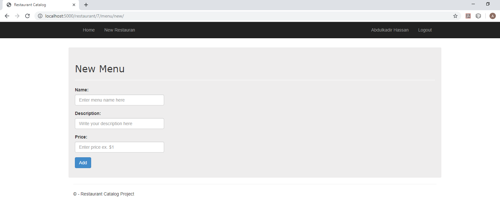
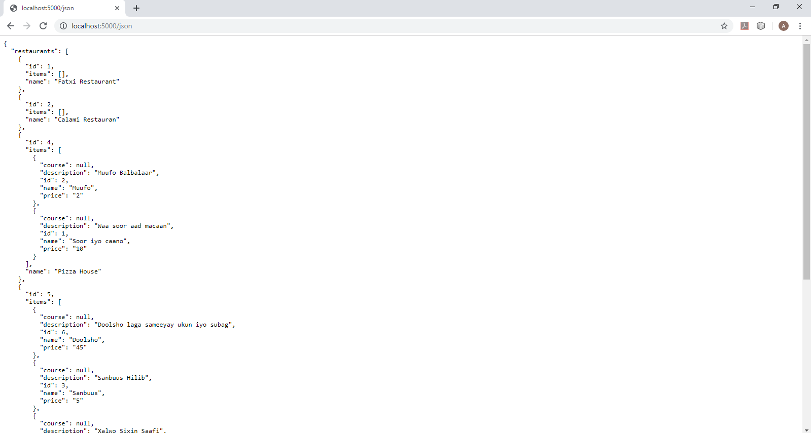

# Item Catalog Project
This is a project for Udacity's 
[Full Stack Web Developer Nanodegree](https://www.udacity.com/course/full-stack-web-developer-nanodegree--nd004)
##Project Overview
The project provides a list of items within a variety of categories as well as provide a user registration and authentication system. Registered users will have the ability to post, edit and delete their own items.
## Why this Project?
1. To enhance student's web development skills. 
1. To develop a RESTful web application using the Python framework Flask. 
1. To implement third-party OAuth authentication. 
## Project Requirements:
This project runs in a virutal machine using Vagrant so to get things done, follow the below steps.
#### Installing the Prerequisites:
1. Install [Vagrant](https://www.vagrantup.com/)
1. Install [VirtualBox](https://www.virtualbox.org/)
1. Download the vagrant setup files from [Udacity's Github](https://github.com/udacity/fullstack-nanodegree-vm)
#### Starting the Virtual Machine:
1. Open Terminal and navigate to the project folders we setup above.
1. cd into the vagrant directory
1. Run ``` vagrant up ``` to build the VM for the first time.
1. Once it is built, run ``` vagrant ssh ``` to connect.
1. cd into the correct project directory: ``` cd /vagrant/restaurant-catalog ```
## Run the program:
1. *models.py*
1. *views.py* 

## Program screen shots: 
### 1. Home page with no user

### 2. Home page with user

### 3. Add new restaurant

### 4. Delete restaurant

### 5. Add new menu

### 6. Json View
